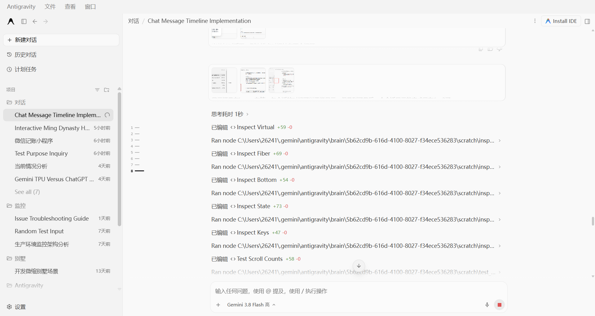
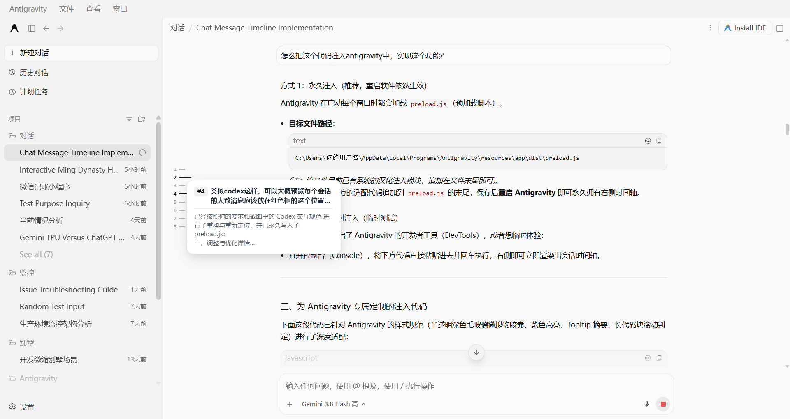

# Antigravity Chat Timeline (Codex Style) 🧭

[中文文档](#-中文说明) | [English Documentation](#-english-documentation)

---

<div align="center">

# 🧭 Antigravity Chat Timeline
**极简 Codex 风格的 Antigravity 桌面端会话轮次锚点时间轴 & 快速导航小地图**
<br>
**A Minimalist Codex-Style Session Timeline Anchor & Mini-Map for Antigravity Desktop**

[](LICENSE)
[]()
[]()

<br>

<p align="center">
  
</p>

<p align="center">
  
</p>

</div>

---

## 🇨🇳 中文说明

### 🌟 特性一览

- 🧭 **Codex 级极简美学**：紧贴主视图左侧分割线挂载，纯粹黑白极简主义（日间浅色 `#18181b`，夜间深色 `#f4f4f5`），杜绝突兀色彩与外围深色胶囊背景。
- 🔢 **智能会话轮次编号**：清晰等宽字体呈现轮次编号（`1 —`、`2 —` ...），当前阅读轮次以加粗长刻度线实时跟踪。
- 🔍 **浮动卡片即时预览**：鼠标悬停在任一刻度线上，即刻浮现对话卡片，完整呈现当前轮次的提问标题（`#N 用户提问`）及 AI 核心回复摘要，内置上下边界智能防溢出算法。
- 🛡️ **虚拟化抗性注册表（Virtualization-Resistant Turn Registry）**：
  - 彻底解决长对话下 Antigravity React DOM 虚拟滚动导致的**丢刻度与重新编号为 1、2 的顽疾**。
  - 会话切换自动隔离，全生命周期持久保序。
- 🔄 **后台静默全量历史补全**：自动在后台平滑同步顶部折叠的早期消息，无需手动滑到最顶端即可在毫秒级内感知完整多轮对话结构。
- ⚡ **毫秒级平滑定位 & 顶部安全边距**：点击任意刻度（包含已被虚拟化卸载的早期消息）平滑滚动跳转，智能预留 **76px 顶部安全边距**，杜绝被固定顶栏遮挡。
- 🌗 **随心自适应主题**：自动感知系统与界面的暗色/亮色模式，毫秒级自适应文字与刻度颜色。

---

### 🚀 快速安装

#### 方式一：一键自动安装（推荐）

1. 克隆或下载本项目：
   ```bash
   git clone https://github.com/czck/antigravity-timeline.git
   cd antigravity-timeline
   ```
2. 运行安装脚本：
   - **Windows 用户**：直接双击运行根目录下的 `install.bat`，或在命令行执行：
     ```bash
     node scripts/install.js
     ```
   - **自动化脚本会自动完成**：
     - 自动定位 Antigravity 本地安装路径下的 `preload.js`；
     - 自动创建原始文件备份 `preload.js.bak`；
     - 安全写入时间轴注入模块，并自动进行 Node 语法完整性校验。
3. **重启 Antigravity 客户端**，进入任意对话即可体验全新时间轴！

---

#### 方式二：手动注入安装

1. 打开 Antigravity 预加载脚本文件：
   - **Windows 路径**：
     `C:\Users\<你的用户名>\AppData\Local\Programs\Antigravity\resources\app\dist\preload.js`
2. 打开本项目中的 [`src/timeline.js`](src/timeline.js)，复制全部代码。
3. 粘贴到 `preload.js` 文件最末尾并保存。
4. 重启 Antigravity 即可。

---

#### 方式三：开发者工具控制台临时体验（免重启）

1. 在 Antigravity 中按下 `Ctrl + Shift + I`（或顶栏「查看」->「切换开发者工具」）打开 DevTools。
2. 切换到 **Console（控制台）** 选项卡。
3. 复制 [`src/timeline.js`](src/timeline.js) 的代码并粘贴回车，左侧即可瞬间渲染出时间轴。

---

### 🧹 卸载方法

- **一键卸载**：
  - Windows 直接双击运行 `uninstall.bat`，或在终端执行：
    ```bash
    node scripts/uninstall.js
    ```
- **手动卸载**：将 `preload.js.bak` 重命名覆盖回 `preload.js`，或删除 `preload.js` 末尾的注入代码块即可。

---

## 🇬🇧 English Documentation

### 🌟 Highlights & Features

- 🧭 **Codex-Style Minimalist Aesthetic**: Cleanly left-docked right next to the scroll container's edge. Monochrome palette (`#18181b` light, `#f4f4f5` dark) with zero garish colors or intrusive outer pill containers.
- 🔢 **Turn-Numbered Monospace Ticks**: Chronologically numbered ticks (`1 —`, `2 —`, ...) using clean monospace typography. The active viewport turn is dynamically highlighted with an elongated line and bold number.
- 🔍 **Interactive Hover Preview Card**: Hovering over any tick reveals an instant popover card showing `#N <User Prompt>` and an excerpt of the AI response. Clamped within viewport safe boundaries to prevent screen clipping.
- 🛡️ **Virtualization-Resistant Turn Registry**:
  - Completely solves the **"only 1, 2 bug"** caused by Antigravity's React DOM unmounting older off-screen turns during long multi-turn conversations.
  - Ticks `1` to `N` remain permanently registered and intact regardless of scroll position.
- 🔄 **Proactive Silent History Preloader**: Seamlessly fetches collapsed older messages in the background in milliseconds without shifting the user's scroll view.
- ⚡ **One-Click Smooth Scroll with Safe Margins**: Clicking any tick (mounted or virtualized) smoothly navigates to the turn with a built-in **76px top safe margin** (`scroll-margin-top`), ensuring headers are never obscured by sticky title bars.
- 🌗 **System-Adaptive Dark/Light Theme**: Seamlessly adapts to light and dark modes with fine-tuned contrast.

---

### 🚀 Quick Start

#### Method 1: Automatic 1-Click Installer (Recommended)

1. Clone or download this repository:
   ```bash
   git clone https://github.com/czck/antigravity-timeline.git
   cd antigravity-timeline
   ```
2. Run the installer:
   - **Windows**: Double-click `install.bat`, or run in terminal:
     ```bash
     node scripts/install.js
     ```
   - The script will:
     - Automatically locate Antigravity's `preload.js`;
     - Create a clean backup `preload.js.bak`;
     - Inject the timeline module and run AST syntax validation.
3. **Restart Antigravity**, and enjoy the session timeline in any conversation!

---

#### Method 2: Manual Injection

1. Locate your Antigravity installation's `preload.js`:
   - **Windows**:
     `C:\Users\<YourUsername>\AppData\Local\Programs\Antigravity\resources\app\dist\preload.js`
2. Open [`src/timeline.js`](src/timeline.js), copy the entire script.
3. Append it to the very end of `preload.js` and save.
4. Restart Antigravity.

---

#### Method 3: Instant Live Preview via DevTools (No Restart Required)

1. Press `Ctrl + Shift + I` inside Antigravity (or menu **View** -> **Toggle Developer Tools**).
2. Open the **Console** tab.
3. Paste the contents of [`src/timeline.js`](src/timeline.js) and press `Enter`. The timeline mounts immediately!

---

### 🧹 Uninstallation

- **Automatic**: Double-click `uninstall.bat` or run:
  ```bash
  node scripts/uninstall.js
  ```
- **Manual**: Restore `preload.js.bak` back to `preload.js`, or remove the injected code block.

---

### 📂 Project Structure

```
antigravity-timeline/
├── assets/
│   ├── screenshot.png         # Main interface overview screenshot
│   └── preview_hover.png      # Hover preview card screenshot
├── scripts/
│   ├── install.js             # Cross-platform Node.js installer
│   └── uninstall.js           # Cross-platform Node.js uninstaller
├── src/
│   └── timeline.js            # Core standalone timeline injector script
├── install.bat                # Windows 1-click install shortcut
├── uninstall.bat              # Windows 1-click uninstall shortcut
├── package.json               # Project manifest
├── LICENSE                    # MIT License
└── README.md                  # Bilingual documentation
```

---

### 📄 License

This project is licensed under the [MIT License](LICENSE).
Feel free to star ⭐️, fork, and contribute!
